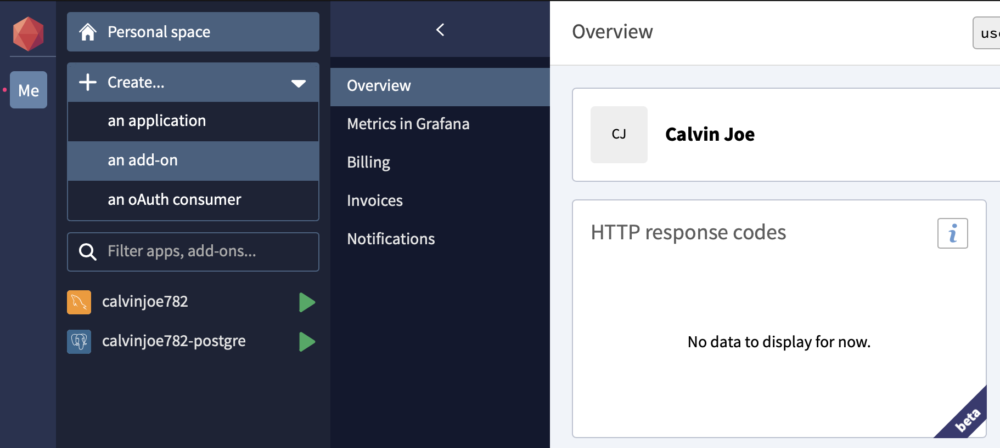

## Object Relational Mapping Node JS using Sequelize

### Prerequisites

* [Node JS](https://nodejs.org/en/)

### Overview


Object-Relational Mapping (ORM) is a technique that lets you query and manipulate data from a database using an object-oriented paradigm. When talking about ORM, most people are referring to a library that implements the Object-Relational Mapping technique, hence the phrase "an ORM".

### Project Setup and Dependencies

Create account in [Clever Cloud](https://www.clever-cloud.com) and create a database account, we will use a `Postgre SQL` for the database.

Choose `Personal Space -> Create -> ad add-on` then choose a `Postgre SQL` and click select. After that choose a plan like below.




Create a project, I use `yarn` package manager for creating this project. And fill the answer from the question of creating a project.

```bash
mkdir orm-nodejs
cd orm-nodejs
yarn init
```

Create `.env` file and fill like below.

```
# Server
SERVER_PORT=8000

# Database
DB_HOST=<YOUR DATABASE HOST>
DB_USER=<YOUR DATABASE USER>
DB_PASSWORD=<YOUR DATABASE PASSWORD>
DB_PORT=<YOUR DATABASE PORT>
DB_NAME=<YOUR DATABASE NAME>
DB_DIALECT=<YOUR DATABASE DIALECT>
```

**Project Structure**

```
.
├── ...
├── app
│   └── config/
│   ├── model/
│   ├── routes/
│   ├── service/
│   ├── util/
│   └── ...
└── .env
└── package.json
└── routes.js
└── schemas.sql
└── server.js
└── yarn.lock
└── ...
```

**Database Design**


I design table for this case using [dbdiagram.io](https://dbdiagram.io/d) and I was create a schemas that can be use to import like following code.

```sql
CREATE SEQUENCE id_transaction_seq start 1 increment 1;
CREATE SEQUENCE id_transaction_detail_seq start 1 increment 1;

CREATE TABLE "transaction" (
  "id" bigint PRIMARY KEY NOT NULL DEFAULT nextval('id_transaction_seq'),
  "created_at" TIMESTAMP NOT NULL,
  "updated_at" TIMESTAMP,
  "transaction_ref_number" varchar(255) NOT NULL,
  "transaction_date" TIMESTAMP NOT NULL,
  "customer_name" varchar(255) NOT NULL,
  "cost" bigint NOT NULL,
  "shipping_cost" bigint NOT NULL
);

CREATE TABLE "transaction_detail" (
  "id" bigint PRIMARY KEY NOT NULL DEFAULT nextval('id_transaction_detail_seq'),
  "created_at" TIMESTAMP NOT NULL,
  "updated_at" TIMESTAMP,
  "transaction_id" bigint NOT NULL,
  "stuff" varchar(255) NOT NULL,
  "price" bigint NOT NULL,
  "qty" int NOT NULL,
  "total" bigint NOT NULL,
  CONSTRAINT fk_transaction FOREIGN KEY (transaction_id) REFERENCES transaction(id)
);
```

**Install Dependency**

Install the required dependencies, type yarn command in terminal like below.

```bash
yarn add express sequelize dotenv pg pg-hstore cors nodemon
```

Add codes below into `package.json`.

```json
"scripts": {
    "dev": "nodemon server"
},
"type": "module",
```

### Implementation

**Create Initial Routes and Server**

Create an initial routes like below.

```js
import { Router } from 'express';

const router = Router();

router.get('/', (req, res, next) => {
    res.json({message: 'ok'});
});

export default router;
```

Create a server to provide the api, fill the code like below.

```js
import express, { json, urlencoded } from "express";
import cors from "cors";
import dotenv from "dotenv";
import routes from  "./routes.js";

dotenv.config();
const app = express();
const PORT = process.env.SERVER_PORT;

var corsOptions = {
    origin: "http://localhost:8000"
};

app.use(cors(corsOptions));
app.use(json());
app.use(urlencoded({ 
    extended: true 
}));

app.use('/api', routes);

app.listen(PORT, () => {
  console.log("Running on port ", PORT);
});
```

Try to run with `yarn run dev` and consume base path with `curl http://localhost:8000/api/` in terminal like below. And we should get an output `{"message":"ok"}`

**Database Configuration**

Create database configuration with `.env` file to load properties in `app/config/database.js` like following code.

```js
import dotenv from 'dotenv';
import { Sequelize } from 'sequelize';
dotenv.config();

const db = new Sequelize(
    process.env.DB_NAME,
    process.env.DB_USER,
    process.env.DB_PASSWORD,
    {
        host: process.env.DB_HOST,
        dialect: process.env.DB_DIALECT,
        pool: {
            max: 5,
            min: 0,
            acquire: 30000,
            idle: 10000
        }
    }
)

export default db;
```

**Model**

Create model `transaction` and `transaction_detail` in `app/model/**`. First, we create `transaction.js` like following code.

```js
import Sequelize from 'sequelize';
import db from '../config/database.js';

const Transaction = db.define('transaction', {
    id: {
        type: Sequelize.INTEGER,
        primaryKey: true,
        allowNull: false,
        defaultValue: db.Sequelize.literal("nextval('id_transaction_seq')")
    },
    createdAt: {
        type: Sequelize.DATE,
        defaultValue: Sequelize.NOW,
        allowNull: false,
        allowNull: false
    },
    updatedAt: {
        type: Sequelize.DATE,
        defaultValue: Sequelize.NOW,
        allowNull: false
    },
    transactionRefNumber: {
        type: Sequelize.STRING,
        allowNull: false
    },
    transactionDate: {
        type: Sequelize.DATE,
        allowNull: false
    },
    customerName: {
        type: Sequelize.STRING,
        allowNull: false
    },
    cost: {
        type: Sequelize.BIGINT,
        allowNull: false
    },
    shippingCost: {
        type: Sequelize.BIGINT,
        allowNull: false
    }
}, {
    tableName: 'transaction',
    underscored: true
});

export default Transaction;
```

And `transactionDetail.js` model like following code.

```js
import Sequelize from 'sequelize';
import db from '../config/database.js';
import Transaction from './transaction.js';

const TransactionDetail = db.define('transaction_detail', {
    id: {
        type: Sequelize.INTEGER,
        primaryKey: true,
        allowNull: false,
        defaultValue: db.Sequelize.literal("nextval('id_transaction_detail_seq')")
    },
    createdAt: {
        type: Sequelize.DATE,
        defaultValue: Sequelize.NOW,
        allowNull: false,
        allowNull: false
    },
    updatedAt: {
        type: Sequelize.DATE,
        defaultValue: Sequelize.NOW,
        allowNull: false
    },
    transactionId: {
        type: Sequelize.BIGINT,
        allowNull: false,
        references: {
            model: 'transaction', // 'transaction' refer to table name
            key: 'id'
        }
    },
    stuff: {
        type: Sequelize.STRING,
        allowNull: false
    },
    price: {
        type: Sequelize.BIGINT,
        allowNull: false
    },
    qty: {
        type: Sequelize.BIGINT,
        allowNull: false
    },
    total: {
        type: Sequelize.BIGINT,
        allowNull: false
    }
}, {
    tableName: 'transaction_detail',
    underscored: true
});

TransactionDetail.belongsTo(Transaction, { as: 'transaction', foreignKey: 'transactionId', targetKey: 'id' });
export default TransactionDetail;
```

Take note for this line 

```js
TransactionDetail.belongsTo(Transaction, { as: 'transaction', foreignKey: 'transactionId', targetKey: 'id' });
```

That mean, `TransactionDetail` have a constraint to `Transaction` model.

**Service to Create a new Transaction**

Create `app/service/transactionService.js` and create method to insert a new transaction like following code.

```js
import Transaction from '../model/transaction.js';
import TransactionDetail from '../model/transactionDetail.js';
import db from '../config/database.js'

export const create = async (req, res, next) => {
    console.log('Start execute create new transaction');

    let t;

    // Get request body
    const request = req.body;
    console.log('Request::: ' + JSON.stringify(request));

    try {
        // define managed transaction
        t = await db.transaction();

        const transaction = await Transaction.create({
            transactionRefNumber: request.transactionRefNumber,
            transactionDate: Date.now(),
            customerName: request.customerName,
            cost: request.cost,
            shippingCost: request.shippingCost
        }, {
            transaction: t
        });
        console.log('Transaction:: ' + transaction);

        for (let i = 0; i < request.details.length; i++) {
            const detail = request.details[i];
            await TransactionDetail.create({
                transactionId: transaction.id,
                stuff: detail.stuff,
                price: detail.price,
                qty: detail.qty,
                total: detail.total,
            }, {
                transaction: t
            });
        }

        // Commit managed transaction
        await t.commit();
        res.send(transaction);
    } catch(err) {
        // Rollback managed transaction
        await t.rollback();

        console.log('Happened error when save transaction data. ', err);
        res.status(500).send({
            message: err.message
        })
    }
    console.log('End execute create new transaction');
}
```

In this code, we use a transactional database `transaction commit and rollback`. So, if we got error when inserting a new row, the database will be rollback to before insert.

**Routing**

Then, we will create a new routes in `app/routes/transactionRoute.js` like following code.

```js
import { Router } from 'express';
import * as transactionService from '../service/transactionService.js';

const router = Router();

// Transaction
router.post('/', transactionService.create);

export default router;
```

Lets try to run by typing in your favourite terminal `yarn run dev`. And open your postman and fill data like below.

```json
POST http://localhost:8000/api/transaction

request body:
{
    "transactionRefNumber": "120003",
    "customerName": "Maverick",
    "cost": 400000,
    "shippingCost": 18000,
    "details": [
        {
            "stuff": "Speaker",
            "price": 200000,
            "qty": 1,
            "total": 200000
        },
        {
            "stuff": "Headset",
            "price": 180000,
            "qty": 1,
            "total": 180000
        },
        {
            "stuff": "Case Iphone 6S",
            "price": 20000,
            "qty": 1,
            "total": 20000
        }
    ]
}
```

ANd we should got an output.

```json
{
  "createdAt": "2021-12-07T06:53:09.403Z",
  "updatedAt": "2021-12-07T06:53:09.410Z",
  "id": "15",
  "transactionRefNumber": "120003",
  "transactionDate": "2021-12-07T06:53:09.401Z",
  "customerName": "Maverick",
  "cost": "400000",
  "shippingCost": "18000"
}
```

**Service to Get All Transaction**

After we create a new transaction, we will create a service to get all of transaction or search transaction by parameter. Add the following code into `app/service/transactionService.js`

```js
import Sequelize from 'sequelize';

export const getAll = async (req, res, next) => {
    console.log('Start execute find all transaction');
    const transactions = await Transaction.findAll();
    res.send(transactions);
    console.log('End execute find all transaction');
}

export const search = async (req, res, next) => {
    console.log('Start execute search transaction by parameter');
    console.log('Search Request:: ' + JSON.stringify(req.body));
    const transaction = await Transaction.findAll({
        where: {
            transactionRefNumber: {
                [Sequelize.Op.like]: '%' + req.body.transactionRefNumber + '%'
            },
            customerName: {
                [Sequelize.Op.like]: '%' + req.body.customerName + '%'
            }
        }
    });
    res.send(transaction);
    console.log('End execute search transaction by parameter');
}
```

**Get All Transaction Routes**

Then, we will create routes to get all transaction or search transaction data by parameter. Add the following code into `app/routes/transactionRoute.js`

```js
router.get('/', transactionService.getAll);
router.get('/search', transactionService.search);
```

Trying our api using postman.

Get all transaction.

```json
GET http://localhost:8000/api/transaction

Response:
[
  {
    "id": "13",
    "createdAt": "2021-12-07T01:20:44.668Z",
    "updatedAt": "2021-12-07T01:20:44.670Z",
    "transactionRefNumber": "120001",
    "transactionDate": "2021-12-07T01:20:44.667Z",
    "customerName": "John Doe",
    "cost": "320000",
    "shippingCost": "8000"
  },
  {
    "id": "14",
    "createdAt": "2021-12-07T01:21:36.088Z",
    "updatedAt": "2021-12-07T01:21:36.090Z",
    "transactionRefNumber": "120002",
    "transactionDate": "2021-12-07T01:21:36.087Z",
    "customerName": "Maverick",
    "cost": "200000",
    "shippingCost": "18000"
  },
  {
    "id": "15",
    "createdAt": "2021-12-07T06:53:09.403Z",
    "updatedAt": "2021-12-07T06:53:09.410Z",
    "transactionRefNumber": "120003",
    "transactionDate": "2021-12-07T06:53:09.401Z",
    "customerName": "Maverick",
    "cost": "400000",
    "shippingCost": "18000"
  }
]
```

Search transaction by parameter.

```json
GET http://localhost:8000/api/transaction/search

Request Body:
{
    "transactionRefNumber": "120003",
    "customerName": ""
}

Response:
[
  {
    "id": "15",
    "createdAt": "2021-12-07T06:53:09.403Z",
    "updatedAt": "2021-12-07T06:53:09.410Z",
    "transactionRefNumber": "120003",
    "transactionDate": "2021-12-07T06:53:09.401Z",
    "customerName": "Maverick",
    "cost": "400000",
    "shippingCost": "18000"
  }
]
```

**Transaction Detail Service**

Create transaction detail service to search, update, or delete transaction detail in `app/service/transactionDetailService.js` like following code.

```js
import db from '../config/database.js'
import TransactionDetail from '../model/transactionDetail.js';
import Sequelize from 'sequelize';

export const search = async (req, res, next) => {
    console.log('Start execute search transaction detail by parameter');
    console.log('Search Request:: ' + JSON.stringify(req.body));
    const transaction = await TransactionDetail.findAll({
        where: {
            [Sequelize.Op.and]: [
                {
                    stuff: {
                        [Sequelize.Op.like]: '%' + req.body.stuff + '%'
                    }
                },
                Sequelize.where(
                    Sequelize.cast(Sequelize.col('transaction_detail.transaction_id'), 'varchar'),
                    {
                        [Sequelize.Op.iLike]: '%' + req.body.transactionId + '%'
                    }
                )
            ]
        }
    });
    res.send(transaction);
    console.log('End execute search transaction detail by parameter');
}

export const update = async (req, res, next) => {
    console.log('Start execute update transaction detail');
    console.log('Transaction detail update Request:: ' + JSON.stringify(req.body));

    let t;

    console.log('Find transaction detail by id:: ' + req.params.id);
    const detail = await TransactionDetail.findByPk(req.params.id);

    if (null == detail) {
        console.log('Data transaction detail not found, cancel update data');
        res.send({message: 'transaction detail: not found'});
        return;
    }

    try {
        t = await db.transaction();

        const detailToUpdate = {
            qty: req.body.qty,
            total: parseInt(detail.total) * req.body.qty
        }

        await TransactionDetail.update(detailToUpdate, {
            where: {
                id: req.params.id
            }
        });

        await t.commit();
        res.send({message: 'success'});
    } catch(err) {
        await t.rollback();
        console.log('Happened error when updating transaction detail');
        res.status(500).send({
            message: err.message
        })
    }
    console.log('End execute update transaction detail');
}

export const deleteById = async(req, res, next) => {
    console.log('Start execute delete transaction detail by id');

    let t;

    console.log('Find transaction detail by id:: ' + req.params.id);
    const detail = await TransactionDetail.findByPk(req.params.id);

    if (null == detail) {
        console.log('Data transaction detail not found, cancel update data');
        res.send({message: 'transaction detail: not found'});
        return;
    }

    try {
        t = await db.transaction();

        await TransactionDetail.destroy({
            where: {
                id: detail.id
            }
        });

        await t.commit();
        res.send({message: 'success'});
    } catch(err) {
        await t.rollback();
        console.log('Happened error when deleting transaction detail');
        res.status(500).send({
            message: err.message
        })
    }
    console.log('End execute delete transaction detail by id');
}
```

**Update Transaction Routes**

Update transaction routes, add the following code into `app/routes/transactionRoute.js`.

```js
import * as transactionDetailService from '../service/transactionDetailService.js';

// Detail
router.get('/detail', transactionDetailService.search);
router.put('/detail/:id', transactionDetailService.update);
router.delete('/detail/:id', transactionDetailService.deleteById);
```

Test our transaction detail api.

Search all transaction detail by parameter.

```json
GET http://localhost:8000/api/transaction/detail

Request Body:
{
    "transactionId": 15,
    "stuff": ""
}

Response:
[
  {
    "id": "9",
    "createdAt": "2021-12-07T06:53:09.687Z",
    "updatedAt": "2021-12-07T06:53:09.688Z",
    "transactionId": "15",
    "stuff": "Speaker",
    "price": "200000",
    "qty": 1,
    "total": "200000"
  },
  {
    "id": "10",
    "createdAt": "2021-12-07T06:53:10.006Z",
    "updatedAt": "2021-12-07T06:53:10.006Z",
    "transactionId": "15",
    "stuff": "Headset",
    "price": "180000",
    "qty": 1,
    "total": "180000"
  },
  {
    "id": "11",
    "createdAt": "2021-12-07T06:53:10.525Z",
    "updatedAt": "2021-12-07T06:53:10.525Z",
    "transactionId": "15",
    "stuff": "Case Iphone 6S",
    "price": "20000",
    "qty": 1,
    "total": "20000"
  }
]
```

Update transaction detail.

```json
PUT http://localhost:8000/api/transaction/detail/11

Request Body:
{
    "qty": 3
}

Response:
{
  "message": "success"
}
```

Delete transaction detail by id.

```json
DELETE http://localhost:8000/api/transaction/detail/11

Response:
{
  "message": "success"
}
```

### Clone or download

You can clone or download this project at

```bash
https://github.com/piinalpin/nodejs-orm.git
```

### References

- [IndahSRamonasari - NodeJS User Product](https://github.com/indahsramonasari/nodejs-user-product)
- [Sequelize - Model Basic](https://sequelize.org/master/manual/model-basics.html)
- [Sequelize - Transactions](https://sequelize.org/master/manual/transactions.html)
- [Auto Increment Id with Sequelize](https://stackoverflow.com/questions/33775165/auto-increment-id-with-sequelize-in-mysql)
- [Sequelize Belong to Relationship](https://stackoverflow.com/questions/59653217/sequelize-5-belongs-to-relation-is-not-working)
- [Sequelize Foreign Key](https://stackoverflow.com/questions/14169655/sequelize-js-foreign-key)
- [mesaugat - Express API ES6 Starter](https://stackoverflow.com/questions/14169655/sequelize-js-foreign-key)